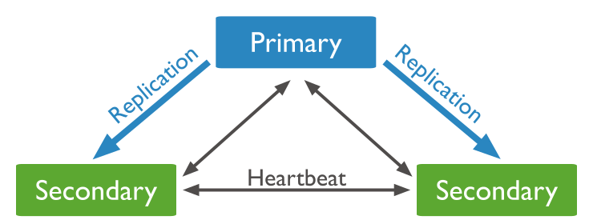
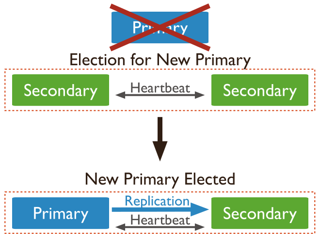

Table of Contents

- [Creating a MongoDB replica set](#creating-a-mongodb-replica-set)
  - [Mongod config](#mongod-config)
  - [Initiate mongodb replicas](#initiate-mongodb-replicas)
    - [1. Status and initiate replica set to create `PRIMARY`](#1-status-and-initiate-replica-set-to-create-primary)
    - [2. Add VPS as `SECONDARY` replica](#2-add-vps-as-secondary-replica)
  - [Read and write in mongodb replicas](#read-and-write-in-mongodb-replicas)
    - [1. write to PRIMARY replica](#1-write-to-primary-replica)
    - [2. read from SECONDARY replica](#2-read-from-secondary-replica)
  - [Some tips about database communication](#some-tips-about-database-communication)
    - [Election](#election)
    - [Arbiter replica](#arbiter-replica)
    - [Less than 3 replica](#less-than-3-replica)
    - [New data while replica have been broken](#new-data-while-replica-have-been-broken)
  - [Behavior of mongodb in some cases](#behavior-of-mongodb-in-some-cases)
    - [1. Restarting one of replicas:](#1-restarting-one-of-replicas)
    - [2. To shutdown `PRIMARY`](#2-to-shutdown-primary)
    - [3. To kill `PRIMARY`](#3-to-kill-primary)
    - [4. To disconnect `PRIMARY`](#4-to-disconnect-primary)
    - [5. To shutdown `SECONDARY`](#5-to-shutdown-secondary)
    - [6. To kill `SECONDARY`](#6-to-kill-secondary)
    - [7. To disconnect `SECONDARY`](#7-to-disconnect-secondary)
    - [8. To fail one of `SECONDARY` while `PRIMARY` write to it](#8-to-fail-one-of-secondary-while-primary-write-to-it)

# Creating a MongoDB replica set

In this doc we are going to set mongodb replica set to sync data between them.

<div style="text-align:center">
<!--  -->

</div>
<!-- --------------------------MongoDB config--------------------------- -->

## Mongod config

First of all you need to modify mongo configuration.\
Set name for replica in `/etc/mongod.conf` config file of any VPS:

```
replication:
	replSetName: rs0
```

Also `bindIp` must be set you `0.0.0.0` or `127.0.0.1,<HOST_IP>`:

```
# network interfaces
net:
  port: 27017
  bindIp: 127.0.0.1,<HOST_IP>
```

> Then restart the mongo by `sudo systemctl restart mongod`.

<!-- --------------------------Initiate mongodb replicas--------------------------- -->

## Initiate mongodb replicas

### 1. Status and initiate replica set to create `PRIMARY`

to check status of replica set run command blown:

```js
rs.status();
```

For now you will see **Error** like this because replica set hasn't been initialize yet.

```json
{
  "ok": 0,
  "errmsg": "no replset config has been received",
  "code": 94,
  "codeName": "NotYetInitialized"
}
```

to initiate replica set run blow command at first:

```js
rs.initiate();
```

result:

```json
{
	"info2" : "no configuration specified. Using a default configuration for the set",
	"me" : "afra-3354-31515:27017",
	"ok" : 1,
	"$clusterTime" : {
		"clusterTime" : Timestamp(1728985882, 1),
		"signature" : {
			"hash" : BinData(0,"AAAAAAAAAAAAAAAAAAAAAAAAAAA="),
			"keyId" : NumberLong(0)
		}
	},
	"operationTime" : Timestamp(1728985882, 1)
}


```

You will see `rs0:PRIMARY` in prompt.

> you can do it in any of the VPS but note that it makes that VPS as `PRIMARY`

> It may need to logout from mongo shell and login again.

now you could run `rs.status()` to check it.

```json
{
	"set" : "rs0",
	"date" : ISODate("2024-10-15T09:53:56.962Z"),
	"myState" : 1,
	"term" : NumberLong(1),
	"syncSourceHost" : "",
	"syncSourceId" : -1,
	"heartbeatIntervalMillis" : NumberLong(2000),
	"majorityVoteCount" : 2,
	"writeMajorityCount" : 2,
	"votingMembersCount" : 2,
	"writableVotingMembersCount" : 2,
	"optimes" : {
		"lastCommittedOpTime" : {
			"ts" : Timestamp(1728986032, 1),
			"t" : NumberLong(1)
		},
		"lastCommittedWallTime" : ISODate("2024-10-15T09:53:52.768Z"),
		"readConcernMajorityOpTime" : {
			"ts" : Timestamp(1728986032, 1),
			"t" : NumberLong(1)
		},
		"readConcernMajorityWallTime" : ISODate("2024-10-15T09:53:52.768Z"),
		"appliedOpTime" : {
			"ts" : Timestamp(1728986032, 1),
			"t" : NumberLong(1)
		},
		"durableOpTime" : {
			"ts" : Timestamp(1728986032, 1),
			"t" : NumberLong(1)
		},
		"lastAppliedWallTime" : ISODate("2024-10-15T09:53:52.768Z"),
		"lastDurableWallTime" : ISODate("2024-10-15T09:53:52.768Z")
	},
	"lastStableRecoveryTimestamp" : Timestamp(1728986002, 1),
	"electionCandidateMetrics" : {
		"lastElectionReason" : "electionTimeout",
		"lastElectionDate" : ISODate("2024-10-15T09:51:22.744Z"),
		"electionTerm" : NumberLong(1),
		"lastCommittedOpTimeAtElection" : {
			"ts" : Timestamp(0, 0),
			"t" : NumberLong(-1)
		},
		"lastSeenOpTimeAtElection" : {
			"ts" : Timestamp(1728985882, 1),
			"t" : NumberLong(-1)
		},
		"numVotesNeeded" : 1,
		"priorityAtElection" : 1,
		"electionTimeoutMillis" : NumberLong(10000),
		"newTermStartDate" : ISODate("2024-10-15T09:51:22.757Z"),
		"wMajorityWriteAvailabilityDate" : ISODate("2024-10-15T09:51:22.859Z")
	},
	"members" : [
		{
			"_id" : 0,
			"name" : "afra-3354-31515:27017",
			"health" : 1,
			"state" : 1,
			"stateStr" : "PRIMARY",
			"uptime" : 184,
			"optime" : {
				"ts" : Timestamp(1728986032, 1),
				"t" : NumberLong(1)
			},
			"optimeDate" : ISODate("2024-10-15T09:53:52Z"),
			"lastAppliedWallTime" : ISODate("2024-10-15T09:53:52.768Z"),
			"lastDurableWallTime" : ISODate("2024-10-15T09:53:52.768Z"),
			"syncSourceHost" : "",
			"syncSourceId" : -1,
			"infoMessage" : "",
			"electionTime" : Timestamp(1728985882, 2),
			"electionDate" : ISODate("2024-10-15T09:51:22Z"),
			"configVersion" : 2,
			"configTerm" : 1,
			"self" : true,
			"lastHeartbeatMessage" : ""
		},
	],
	"ok" : 1,
	"$clusterTime" : {
		"clusterTime" : Timestamp(1728986032, 1),
		"signature" : {
			"hash" : BinData(0,"AAAAAAAAAAAAAAAAAAAAAAAAAAA="),
			"keyId" : NumberLong(0)
		}
	},
	"operationTime" : Timestamp(1728986032, 1)
}


```

### 2. Add VPS as `SECONDARY` replica

and now you can add any container as **SECONDARY** replica by its `hostUrl` and `port`:

```js
rs.add("<HOST_URL>:<PORT>");
```

as result you will see:

```json
{
	"ok" : 1,
	"$clusterTime" : {
		"clusterTime" : Timestamp(1728985911, 1),
		"signature" : {
			"hash" : BinData(0,"AAAAAAAAAAAAAAAAAAAAAAAAAAA="),
			"keyId" : NumberLong(0)
		}
	},
	"operationTime" : Timestamp(1728985911, 1)
}

```

now you could run `rs.status()` to check it.
here you can check every replica and its information below `members` field:

```json
{
	"ok" : 1,
	"$clusterTime" : {
		"clusterTime" : Timestamp(1728985911, 1),
		"signature" : {
			"hash" : BinData(0,"AAAAAAAAAAAAAAAAAAAAAAAAAAA="),
			"keyId" : NumberLong(0)
		}
	},
	"operationTime" : Timestamp(1728985911, 1)
}
rs0:PRIMARY> rs.status()
{
	"set" : "rs0",
	"date" : ISODate("2024-10-15T09:53:56.962Z"),
	"myState" : 1,
	"term" : NumberLong(1),
	"syncSourceHost" : "",
	"syncSourceId" : -1,
	"heartbeatIntervalMillis" : NumberLong(2000),
	"majorityVoteCount" : 2,
	"writeMajorityCount" : 2,
	"votingMembersCount" : 2,
	"writableVotingMembersCount" : 2,
	"optimes" : {
		"lastCommittedOpTime" : {
			"ts" : Timestamp(1728986032, 1),
			"t" : NumberLong(1)
		},
		"lastCommittedWallTime" : ISODate("2024-10-15T09:53:52.768Z"),
		"readConcernMajorityOpTime" : {
			"ts" : Timestamp(1728986032, 1),
			"t" : NumberLong(1)
		},
		"readConcernMajorityWallTime" : ISODate("2024-10-15T09:53:52.768Z"),
		"appliedOpTime" : {
			"ts" : Timestamp(1728986032, 1),
			"t" : NumberLong(1)
		},
		"durableOpTime" : {
			"ts" : Timestamp(1728986032, 1),
			"t" : NumberLong(1)
		},
		"lastAppliedWallTime" : ISODate("2024-10-15T09:53:52.768Z"),
		"lastDurableWallTime" : ISODate("2024-10-15T09:53:52.768Z")
	},
	"lastStableRecoveryTimestamp" : Timestamp(1728986002, 1),
	"electionCandidateMetrics" : {
		"lastElectionReason" : "electionTimeout",
		"lastElectionDate" : ISODate("2024-10-15T09:51:22.744Z"),
		"electionTerm" : NumberLong(1),
		"lastCommittedOpTimeAtElection" : {
			"ts" : Timestamp(0, 0),
			"t" : NumberLong(-1)
		},
		"lastSeenOpTimeAtElection" : {
			"ts" : Timestamp(1728985882, 1),
			"t" : NumberLong(-1)
		},
		"numVotesNeeded" : 1,
		"priorityAtElection" : 1,
		"electionTimeoutMillis" : NumberLong(10000),
		"newTermStartDate" : ISODate("2024-10-15T09:51:22.757Z"),
		"wMajorityWriteAvailabilityDate" : ISODate("2024-10-15T09:51:22.859Z")
	},
	"members" : [
		{
			"_id" : 0,
			"name" : "afra-3354-31515:27017",
			"health" : 1,
			"state" : 1,
			"stateStr" : "PRIMARY",
			"uptime" : 184,
			"optime" : {
				"ts" : Timestamp(1728986032, 1),
				"t" : NumberLong(1)
			},
			"optimeDate" : ISODate("2024-10-15T09:53:52Z"),
			"lastAppliedWallTime" : ISODate("2024-10-15T09:53:52.768Z"),
			"lastDurableWallTime" : ISODate("2024-10-15T09:53:52.768Z"),
			"syncSourceHost" : "",
			"syncSourceId" : -1,
			"infoMessage" : "",
			"electionTime" : Timestamp(1728985882, 2),
			"electionDate" : ISODate("2024-10-15T09:51:22Z"),
			"configVersion" : 2,
			"configTerm" : 1,
			"self" : true,
			"lastHeartbeatMessage" : ""
		},
		{
			"_id" : 1,
			"name" : "79.175.162.192:27017",
			"health" : 1,
			"state" : 2,
			"stateStr" : "SECONDARY",
			"uptime" : 125,
			"optime" : {
				"ts" : Timestamp(1728986032, 1),
				"t" : NumberLong(1)
			},
			"optimeDurable" : {
				"ts" : Timestamp(1728986032, 1),
				"t" : NumberLong(1)
			},
			"optimeDate" : ISODate("2024-10-15T09:53:52Z"),
			"optimeDurableDate" : ISODate("2024-10-15T09:53:52Z"),
			"lastAppliedWallTime" : ISODate("2024-10-15T09:53:52.768Z"),
			"lastDurableWallTime" : ISODate("2024-10-15T09:53:52.768Z"),
			"lastHeartbeat" : ISODate("2024-10-15T09:53:55.955Z"),
			"lastHeartbeatRecv" : ISODate("2024-10-15T09:53:55.428Z"),
			"pingMs" : NumberLong(1),
			"lastHeartbeatMessage" : "",
			"syncSourceHost" : "afra-3354-31515:27017",
			"syncSourceId" : 0,
			"infoMessage" : "",
			"configVersion" : 2,
			"configTerm" : 1
		}
	],
	"ok" : 1,
	"$clusterTime" : {
		"clusterTime" : Timestamp(1728986032, 1),
		"signature" : {
			"hash" : BinData(0,"AAAAAAAAAAAAAAAAAAAAAAAAAAA="),
			"keyId" : NumberLong(0)
		}
	},
	"operationTime" : Timestamp(1728986032, 1)
}

```

<!-- ----------------------Read and write in mongodb replicas----------------------- -->

## Read and write in mongodb replicas

### 1. write to PRIMARY replica

insert data to **primary** replica

```js
use shahbaz
```

```js
db.createCollection("products");
```

```js
db.products.insertOne({ name: "test1" });
```

### 2. read from SECONDARY replica

to read from **SECONDARY** at first if you run read command you will receive blow **Error**:

```js
db.products.find();
```

Error:

```json
Error: error: {
	"topologyVersion" : {
		"processId" : ObjectId("670e37f96265498072923dd6"),
		"counter" : NumberLong(3)
	},
	"operationTime" : Timestamp(1728986454, 1),
	"ok" : 0,
	"errmsg" : "not master and slaveOk=false",
	"code" : 13435,
	"codeName" : "NotPrimaryNoSecondaryOk",
	"$clusterTime" : {
		"clusterTime" : Timestamp(1728986454, 1),
		"signature" : {
			"hash" : BinData(0,"AAAAAAAAAAAAAAAAAAAAAAAAAAA="),
			"keyId" : NumberLong(0)
		}
	}
}

```

> so we have to run `rs.secondaryOk()` command to let the shell know that we are intentionally querying a database that is not our primary.

finally we can read form database:

```js
db.products.find();
```

result:

```json
{ "_id" : ObjectId("670d19d5301d7b3941d087e0"), "name" : "test1" }
```

<!-- -----------------Different scenarios in replicas communication------------------ -->

## Some tips about database communication

### Election

If one of replica goes down, others hold an election to choose new **PRIMARY**

<div style="text-align:center">

</div>

### Arbiter replica

we should have 3 or more replicas and the number must be **odd** to get succeeded election or have one **arbiter** replica which doesn't maintain any data but participate in election to choose **PRIMARY** replica.

To add arbiter replica use follow command

```js
rs.addArb("<HOST_URL:PORT>");
```

### Less than 3 replica

If we need just 2 replica there is two way of handle it

1. we should add another replica as arbiter
2. If we don't add any arbiter and either of replica break down, it doesn't have **PRIMARY** anymore. In this case we must make alive replica (which turns to **SECONDARY**) as **PRIMARY** manually

In this case to make **SECONDARY** as **PRIMARY** manually, we have 2 way

1. remove broken replica from config:

   ```js
   cfg = rs.conf();
   cfg.members = [cfg.members["<ALIVE_REPLICA_INDEX>"]];
   rs.reconfig(cfg);
   ```

   > After startup of any replica we must add it to replica set manually.
   >
   > ```
   > rs.addArb(<HOST_URL:PORT>)
   > ```

2. change `votes` and `priority` of each replica to `0` except alive replica whose `votes` must be `1` and `priority` must be at least `1`:

   ```js
   cfg = rs.conf();

   for (let replica of cfg.members) {
     if (replica.host == "<ALIVE_REPLICA_INDEX>") {
       replica.votes = 1;
       replica.priority = 1;
     } else {
       replica.votes = 0;
       replica.priority = 0;
     }
   }

   rs.reconfig(cfg);
   ```

   > After startup of any replica we must reconfigure to initial config.
   >
   > ```js
   > cfg = rs.conf();
   >
   > for (let replica of cfg.members) {
   >   if (replica.host == "<ALIVE_REPLICA_INDEX>") {
   >     replica.votes = 1;
   >     replica.priority = 1;
   >   } else {
   >     replica.votes = 0;
   >     replica.priority = 0;
   >   }
   > }
   >
   > rs.reconfig(cfg);
   > ```

### New data while replica have been broken

If a replica is broken and any data write to database afterwards, it would get new data after the next startup.

## Behavior of mongodb in some cases

### 1. Restarting one of replicas:

if one of replica restart it will actually lose its connection to others and automatically it will be added to the cluster after the next startup.

> `mongod` service must be enabled.

### 2. To shutdown `PRIMARY`

- **Behavior of other replicas:**

  Consider `PRIMARY` replica shutdowns, in this case other replicas hold an election to choose new `PRIMARY`.

- **Syncing data:**

  Consider `PRIMARY` replica shutdowns, in this case we add some changes such as adding data and collection. It will receive new changes after the next startup.

### 3. To kill `PRIMARY`

> This is done by `kill -9 PID`

- **Behavior of other replicas:**

  Consider `PRIMARY` replica gets killed, in this case other replicas hold an election to choose new `PRIMARY`.

- **Syncing data:**

  Consider `PRIMARY` replica gets killed, in this case we add some changes such as adding data and collection. It will receive new changes after the next startup.

### 4. To disconnect `PRIMARY`

> This issue is simulated by firewall

- **Behavior of other replicas:**

  Consider `PRIMARY` replica gets disconnected, in this case other replicas hold an election to choose new `PRIMARY`. Disconnected replica will became as `SECONDARY`

- **Syncing data:**

  Consider `PRIMARY` replica gets disconnected, in this case we add some changes such as adding data and collection. It will receive new changes after the next startup.

### 5. To shutdown `SECONDARY`

- **Behavior of other replicas:**

  Consider `SECONDARY` replica shutdowns, in this case other replicas hold an election to choose new `PRIMARY`.

- **Syncing data:**

  Consider `SECONDARY` replica shutdowns, in this case we add some changes such as adding data and collection. It will receive new changes after the next startup.

### 6. To kill `SECONDARY`

> This is done by `kill -9 PID`

- **Behavior of other replicas:**

  Consider `SECONDARY` replica gets killed, in this case other replicas continue working.

- **Syncing data:**

  Consider `SECONDARY` replica gets killed, in this case we add some changes such as adding data and collection. It will receive new changes after the next startup.

### 7. To disconnect `SECONDARY`

> This issue is simulated by firewall

- **Behavior of other replicas:**

  Consider `SECONDARY` replica gets disconnected, in this case other replicas continue working. Disconnected replica remain as `SECONDARY`.

- **Syncing data:**

  Consider `SECONDARY` replica gets disconnected, in this case we add some changes such as adding data and collection. It will receive new changes after the next startup.

### 8. To fail one of `SECONDARY` while `PRIMARY` write to it

- **Behavior of other replicas:**

  Consider `SECONDARY` replica failed, in this case other replicas continue working.

- **Syncing data:**

  Consider `SECONDARY` replica failed, in this case we add some changes such as adding data and collection. It will receive new changes after the next startup.
