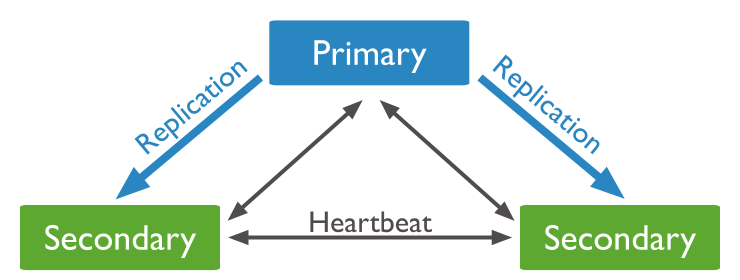

# Table of Contents

- [Table of Contents](#table-of-contents)
- [Creating a MongoDB replica set using Docker](#creating-a-mongodb-replica-set-using-docker)
  - [MongoDB Docker image](#mongodb-docker-image)
    - [1. MongoDB image](#1-mongodb-image)
    - [2. Create docker network called](#2-create-docker-network-called)
    - [3. Setting up our containers](#3-setting-up-our-containers)
  - [Initiate mongodb replicas](#initiate-mongodb-replicas)
    - [1. connect to mongo shell in any of the containers](#1-connect-to-mongo-shell-in-any-of-the-containers)
    - [2. Status and initiate replica set](#2-status-and-initiate-replica-set)
    - [3. Add container as `SECONDARY` replica](#3-add-container-as-secondary-replica)
  - [Read and write in mongodb replicas](#read-and-write-in-mongodb-replicas)
    - [1. write to PRIMARY replica](#1-write-to-primary-replica)
    - [1. read from SECONDARY replica](#1-read-from-secondary-replica)

# Creating a MongoDB replica set using Docker

In this doc we are going to set mongodb replica set to sync data between them.



<!-- --------------------------MongoDB Docker image--------------------------- -->

## MongoDB Docker image

Firstly it is described how to create mongodb container

### 1. MongoDB image

MongoDB image must be pulled:

```shell
docker image pull mongodb:4.4.2
```

> here we pull mongodb with tag version 4.4.2

### 2. Create docker network called

To connect containers together we need to create docker network called `my-mongo-cluster`:

```shell
docker network create my-mongo-cluster
```

> to see all network run blow command:
>
> ```shell
> docker network ls
> ```

### 3. Setting up our containers

Start first container with name of `mongo1`:

```shell
docker run -p 30001:27017 --name mongo1 --net my-mongo-cluster mongo mongod --replSet my-mongo-set
```

- `docker run` : Start a container from an image
- `-p 30001:27017` : Expose port 27017 in our container, as port 30001 on the localhost
- `--name mongo1` : name this container “mongo1”
- `--net my-mongo-cluster` : Add this container to the “my-mongo-cluster” network.
- `mongo` : the name of the image we are using to spawn this container
- `mongod --replSet my-mongo-set` : Run mongod while adding this mongod instance to the replica set named “my-mongo-set”

run 2 another containers as well with name of `mongo2`, `mongo3`

> to run up command it is needed to change it for any container

<!-- --------------------------Initiate mongodb replicas--------------------------- -->

## Initiate mongodb replicas

### 1. connect to mongo shell in any of the containers

to connect to each of container's mongo shell run blow command:

```shell
docker exec -it mongo1 mongo
```

### 2. Status and initiate replica set

to check status of replica set run command blown:

```js
rs.status();
```

For now you will see **Error** like this because replica set hasn't been set yet.

```json
{
	"operationTime" : Timestamp(0, 0),
	"ok" : 0,
	"errmsg" : "no replset config has been received",
	"code" : 94,
	"codeName" : "NotYetInitialized",
	"$clusterTime" : {
		"clusterTime" : Timestamp(0, 0),
		"signature" : {
			"hash" : BinData(0,"AAAAAAAAAAAAAAAAAAAAAAAAAAA="),
			"keyId" : NumberLong(0)
		}
	}
}

```

to initiate replica set run blow command at first:

```js
rs.initiate();
```

> you can do it in any of the containers but note that it is going to make that container as `PRIMARY`

### 3. Add container as `SECONDARY` replica

and now you can add any container as **SECONDARY** replica by its `hostUrl` and `port`:

```js
rs.add("mongo2:27017");
```

as result you will see:

```json
{
	"ok" : 1,
	"$clusterTime" : {
		"clusterTime" : Timestamp(1728909886, 1),
		"signature" : {
			"hash" : BinData(0,"AAAAAAAAAAAAAAAAAAAAAAAAAAA="),
			"keyId" : NumberLong(0)
		}
	},
	"operationTime" : Timestamp(1728909886, 1)
}

```

now you could run `rs.status()` to check it.
here you can check every replica and its information below `members` field:

```json

{
	"set" : "my-mongo-set",
	"date" : ISODate("2024-10-14T12:45:00.041Z"),
	"myState" : 1,
	"term" : NumberLong(1),
	"syncSourceHost" : "",
	"syncSourceId" : -1,
	"heartbeatIntervalMillis" : NumberLong(2000),
	"majorityVoteCount" : 2,
	"writeMajorityCount" : 2,
	"votingMembersCount" : 2,
	"writableVotingMembersCount" : 2,
	"optimes" : {
		"lastCommittedOpTime" : {
			"ts" : Timestamp(1728909886, 1),
			"t" : NumberLong(1)
		},
		"lastCommittedWallTime" : ISODate("2024-10-14T12:44:46.850Z"),
		"readConcernMajorityOpTime" : {
			"ts" : Timestamp(1728909886, 1),
			"t" : NumberLong(1)
		},
		"readConcernMajorityWallTime" : ISODate("2024-10-14T12:44:46.850Z"),
		"appliedOpTime" : {
			"ts" : Timestamp(1728909886, 1),
			"t" : NumberLong(1)
		},
		"durableOpTime" : {
			"ts" : Timestamp(1728909886, 1),
			"t" : NumberLong(1)
		},
		"lastAppliedWallTime" : ISODate("2024-10-14T12:44:46.850Z"),
		"lastDurableWallTime" : ISODate("2024-10-14T12:44:46.850Z")
	},
	"lastStableRecoveryTimestamp" : Timestamp(1728909884, 1),
	"electionCandidateMetrics" : {
		"lastElectionReason" : "electionTimeout",
		"lastElectionDate" : ISODate("2024-10-14T12:42:44.579Z"),
		"electionTerm" : NumberLong(1),
		"lastCommittedOpTimeAtElection" : {
			"ts" : Timestamp(0, 0),
			"t" : NumberLong(-1)
		},
		"lastSeenOpTimeAtElection" : {
			"ts" : Timestamp(1728909764, 1),
			"t" : NumberLong(-1)
		},
		"numVotesNeeded" : 1,
		"priorityAtElection" : 1,
		"electionTimeoutMillis" : NumberLong(10000),
		"newTermStartDate" : ISODate("2024-10-14T12:42:44.633Z"),
		"wMajorityWriteAvailabilityDate" : ISODate("2024-10-14T12:42:44.716Z")
	},
	"members" : [
		{
			"_id" : 0,
			"name" : "1ea5defd5dd3:27017",
			"health" : 1,
			"state" : 1,
			"stateStr" : "PRIMARY",
			"uptime" : 803,
			"optime" : {
				"ts" : Timestamp(1728909886, 1),
				"t" : NumberLong(1)
			},
			"optimeDate" : ISODate("2024-10-14T12:44:46Z"),
			"syncSourceHost" : "",
			"syncSourceId" : -1,
			"infoMessage" : "",
			"electionTime" : Timestamp(1728909764, 2),
			"electionDate" : ISODate("2024-10-14T12:42:44Z"),
			"configVersion" : 2,
			"configTerm" : 1,
			"self" : true,
			"lastHeartbeatMessage" : ""
		},
		{
			"_id" : 1,
			"name" : "mongo2:27017",
			"health" : 1,
			"state" : 2,
			"stateStr" : "SECONDARY",
			"uptime" : 13,
			"optime" : {
				"ts" : Timestamp(1728909886, 1),
				"t" : NumberLong(1)
			},
			"optimeDurable" : {
				"ts" : Timestamp(1728909886, 1),
				"t" : NumberLong(1)
			},
			"optimeDate" : ISODate("2024-10-14T12:44:46Z"),
			"optimeDurableDate" : ISODate("2024-10-14T12:44:46Z"),
			"lastHeartbeat" : ISODate("2024-10-14T12:44:58.872Z"),
			"lastHeartbeatRecv" : ISODate("2024-10-14T12:44:59.652Z"),
			"pingMs" : NumberLong(0),
			"lastHeartbeatMessage" : "",
			"syncSourceHost" : "",
			"syncSourceId" : -1,
			"infoMessage" : "",
			"configVersion" : 2,
			"configTerm" : 1
		}
	],
	"ok" : 1,
	"$clusterTime" : {
		"clusterTime" : Timestamp(1728909886, 1),
		"signature" : {
			"hash" : BinData(0,"AAAAAAAAAAAAAAAAAAAAAAAAAAA="),
			"keyId" : NumberLong(0)
		}
	},
	"operationTime" : Timestamp(1728909886, 1)
}
```

<!-- ----------------------Read and write in mongodb replicas----------------------- -->

## Read and write in mongodb replicas

### 1. write to PRIMARY replica

insert data to `mongo1` as **primary** replica

```js
use shahbaz
```

```js
db.createCollection("product");
```

```js
db.product.insertOne({name"test1"})
```

### 1. read from SECONDARY replica

to read from `mongo2` as **SECONDARY** at first you will receive blow **Error**:

```json
uncaught exception: Error: listDatabases failed:{
	"topologyVersion" : {
		"processId" : ObjectId("670d0fa0492131bf6acdca59"),
		"counter" : NumberLong(3)
	},
	"operationTime" : Timestamp(1728911254, 1),
	"ok" : 0,
	"errmsg" : "not master and slaveOk=false",
	"code" : 13435,
	"codeName" : "NotPrimaryNoSecondaryOk",
	"$clusterTime" : {
		"clusterTime" : Timestamp(1728911254, 1),
		"signature" : {
			"hash" : BinData(0,"AAAAAAAAAAAAAAAAAAAAAAAAAAA="),
			"keyId" : NumberLong(0)
		}
	}
} :
_getErrorWithCode@src/mongo/shell/utils.js:25:13
Mongo.prototype.getDBs/<@src/mongo/shell/mongo.js:147:19
Mongo.prototype.getDBs@src/mongo/shell/mongo.js:99:12
shellHelper.show@src/mongo/shell/utils.js:937:13
shellHelper@src/mongo/shell/utils.js:819:15
@(shellhelp2):1:1

```

> so we have to run `rs.secondaryOk()` command to let the shell know that we are intentionally querying a database that is not our primary.

finally we can read form database:

```js
db.product.find();
```

result:

```json
{ "_id" : ObjectId("670d19d5301d7b3941d087e0"), "name" : "test1" }
```
